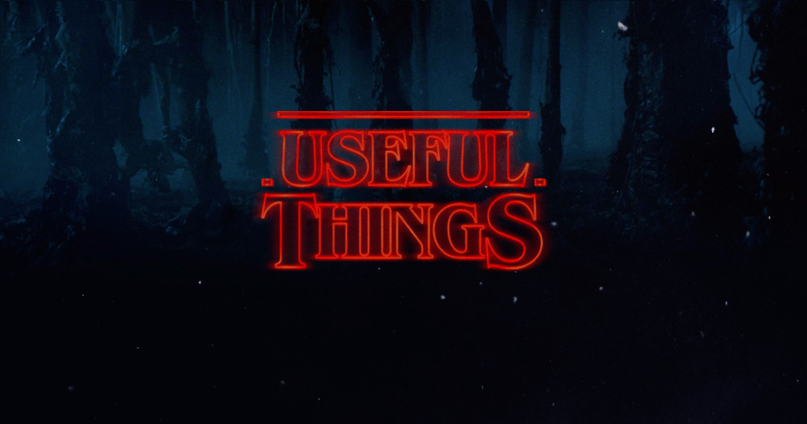

#  UsefulThings

During my projects in iOS Development I has been often exposed to similar tasks so I made this framework which contains following functions. Most of them (almost every) of them is result of pain and stackoverlying (and I don't feel ashamed by it).

## Array
## CAShapeLayer
## String
## FileManager
## SegueHelper
## Dictionary
## Date
## #UITableView
## UIViewController
## UIBarButtonItem
## UIImage
## UITableViewCell
## UIView
## UIScrollView
## UIScrollView
## UIColor
## NSLayoutConstrain
## NSDate
## NSData
## AVPlayerViewController
## UILocalized

